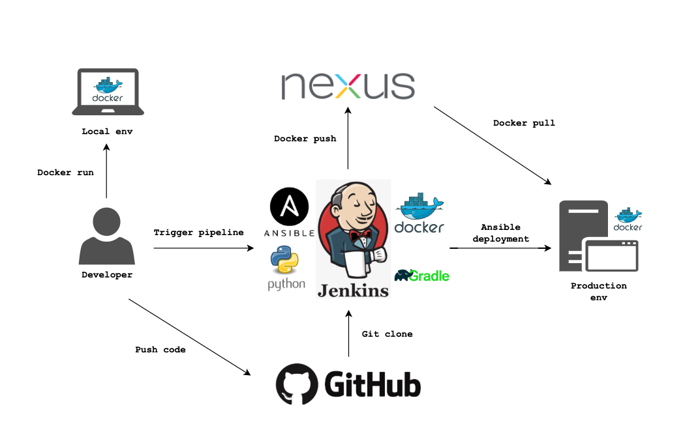
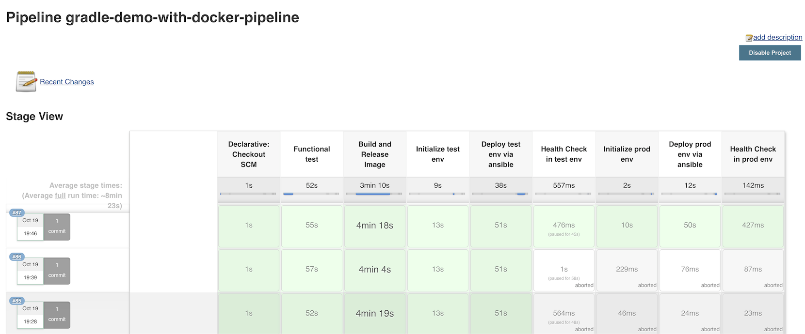

# gradle-demo-with-docker

The following is how to use jenkins CI/CD pipeline to build and release a gradle application via docker.

The repo contains Jenkinsfile, ansible playbook, Java application, gradle configurations, shell scripts and etc.

## Architecture



## Procedure



```txt
Checkout source code  ==> Functional test ==> Build and release image  ==> Initialize test env ==> Deploy test env via ansible ==> Health Check in test env ==> Initialize prod env ==> Deploy prod env via ansible ==> Health Check in prod env
```

Remember to proactive the prerequisite before rollout the pipeline.

## Prerequisite

```txt
Github ===> Git repo

Jenkins ===> CI/CD system

Docker ===> Docker container

Java ===> Java programming language

Gradle ===> Java Build tool

Nexus ===> Binary Package Repo

Python ===> Ansible dependency

Ansible ===> Deployment tool
```

## Runbook

1. Build all prerequisites in an instance or more instances depend on your budget

2. Create an [ansible docker](https://github.com/showerlee/gradle-demo-with-docker/tree/master/ansible) in Jenkins node.

3. Create a jenkins pipeline item

4. Setup github(webhook) and AnsiColor jenkins plugin

5. Provision current repo in pipeline setting with proper credential

6. Rock and roll
